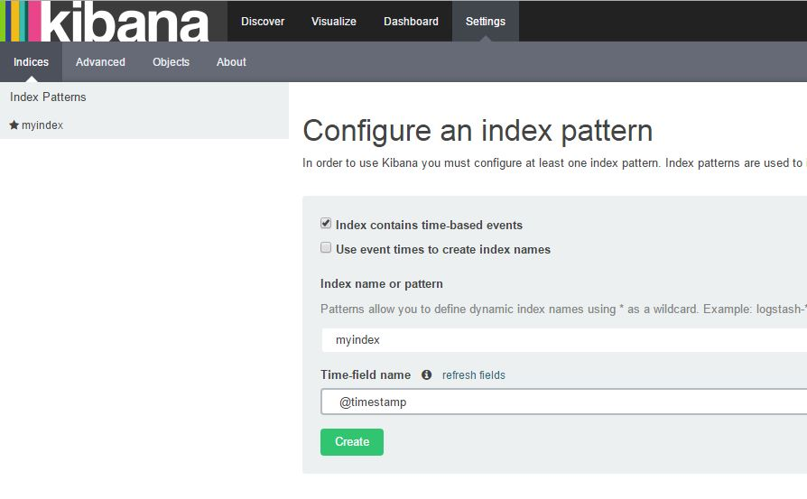
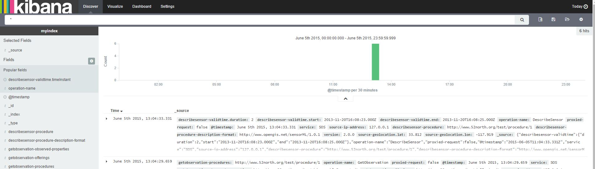
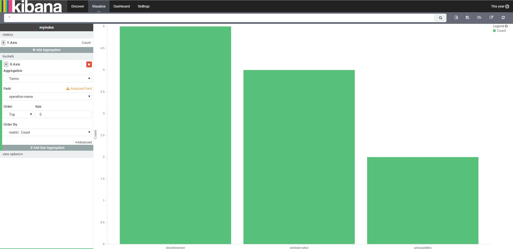

#Architectural overview

The SosStatisticsLoggerListener class receives the events from the SosEventBus. Currently only the RequestEvent are processed.

The SosRequestLoggingResolver routes the Request object based on the event's request type to the proper XXXHandler classes. (e.g. GetCapabilitiesRequestHandler, DescribeSensorRequestHandler etc...)

In the XXXHandlers the data will be extracted from the Request object and a Map<String,Object> is given back containing the extracted informations.

This Map<String,Object> is persisted to the ElasticSearch database. The ElasticSearch client API automatically converts the Objects to JSON strings. Even the 
Map<String,Map<String,Object>> hierarchical embedded maps also.

#Setup

- Checkout this branch.
- Install ElasticSearch on your local machine. https://www.elastic.co/downloads/elasticsearch the 1.5.2 version
- Open up the ElasticSearch config file under the config/elasticsearch.yml. Modify the clustername to 
` cluster.name: embedded-cluster `
- Install Kibana 4.X on your local machine. https://www.elastic.co/downloads/kibana
- Run `maven clean install -DskipTests=true` from the SOS root project.
- Run  `jetty:run` from the webapp module. If the port is already occupied, go to the webapp/pom.xml file and change it under the Jetty <plugin> section.
- Goto localhost:8080 and set up your SOS deployments. 
- Start elasticsearch with `bin/elasticsearch.bat` on windows 
- Start kibana with `bin\kibana.bat` on windows
- Import the SoupUI project to your soap workspace. The soap project is located in the statistics module src/test/resources/sopUI/SOSBulkRequests.xml
- Run the test cases from the SoupUI.
- Set up the index in kibana the index name is now `myindex` and the timestamp field is `@timestamp`

- Head to the discover mode and check if you see any raw data there.

- with the default kibana settings setup click on the link to view the bar chart of the number of counts by request types this year.

http://localhost:5601/#/visualize/create?type=histogram&indexPattern=myindex&_g=(refreshInterval:(display:Off,section:0,value:0),time:(from:now%2Fy,mode:quick,to:now%2Fy))&_a=(filters:!(),linked:!f,query:(query_string:(analyze_wildcard:!t,query:'*')),vis:(aggs:!((id:'1',params:(),schema:metric,type:count),(id:'2',params:(field:operation-name,order:desc,orderBy:'1',size:5),schema:segment,type:terms)),listeners:(),params:(addLegend:!t,addTooltip:!t,defaultYExtents:!f,mode:stacked,shareYAxis:!t),type:histogram))
